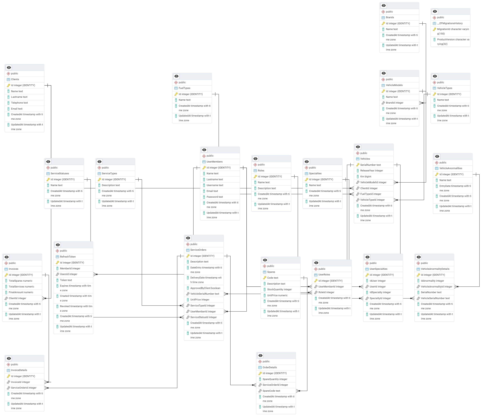

# AutoTallerManager

**AutoTallerManager** is a web-based management system for automotive workshops. It supports roles such as Administrator, Receptionist, and Mechanic, enabling full control over service orders, vehicles, spare parts, invoices, and users.

## 🛠️ Technologies Used

- **Frontend:** Angular 16+
- **Backend:** ASP.NET Core 7+ (Web API)
- **Database:** PostgreSQL
- **ORM:** Entity Framework Core
- **Authentication:** JWT (JSON Web Tokens)

---

## ER model




## 🚀 Getting Started

### 1. Clone the repository

```bash
git clone https://github.com/dayana82006/AutoTallerEF.git
````

### 2. Backend Setup

1. Go to the backend project directory:

```bash
cd TallerApi
```

2. Restore dependencies and apply migrations:

```bash
dotnet restore
dotnet ef database update
```

3. **Insert required initial data** into the database after migrations:

Connect to your PostgreSQL database and run the following SQL:

```sql
-- BRANDS
INSERT INTO "Brands" ("Name", "CreatedAt", "UpdatedAt") VALUES 
('Toyota',    now(), now()),
('Ford',      now(), now()),
('Chevrolet', now(), now()),
('Honda',     now(), now()),
('Nissan',    now(), now());

INSERT INTO "VehicleModels" ("Name", "BrandId", "CreatedAt", "UpdatedAt") VALUES
('Corolla', 1, now(), now()),
('Hilux', 1, now(), now()),
('Fiesta', 2, now(), now()),
('Mustang', 2, now(), now()),
('Spark', 3, now(), now()),
('Cruze', 3, now(), now()),
('Civic', 4, now(), now()),
('Accord', 4, now(), now()),
('Sentra', 5, now(), now()),
('X-Trail', 5, now(), now());


-- FUEL TYPES
INSERT INTO "FuelTypes" ("Name", "CreatedAt", "UpdatedAt") VALUES 
('Gasoline', now(), now()),
('Diesel',   now(), now()),
('Electric', now(), now()),
('Hybrid',   now(), now());

-- VEHICLE TYPES
INSERT INTO "VehicleTypes" ("Name", "CreatedAt", "UpdatedAt") VALUES 
('Sedan',     now(), now()),
('SUV',       now(), now()),
('Pickup',    now(), now()),
('Hatchback', now(), now()),
('Van',       now(), now());

-- SERVICE STATUSES
INSERT INTO "ServiceStatuses" ("Name", "CreatedAt", "UpdatedAt")
VALUES
  ('Pendiente', now(), now()),
  ('En proceso', now(), now()),
  ('Finalizado', now(), now());

-- ROLES
INSERT INTO "Roles" ("Id", "Name", "Description", "CreatedAt", "UpdatedAt")
VALUES
  (1, 'Administrador', 'Usuario con acceso total al sistema', NOW(), NOW()),
  (2, 'Recepcionista', 'Encargado de recibir vehículos y coordinar órdenes', NOW(), NOW()),
  (3, 'Mecanico', 'Responsable de realizar servicios técnicos', NOW(), NOW());
```

4. Run the backend:

```bash
dotnet run
```

The backend will be available at:
📡 [http://localhost:5005](http://localhost:5005)

---

### 3. Frontend Setup

1. Go to the Angular project directory:

```bash
cd autotaller-manager
```

2. Install dependencies:

```bash
npm install
```

3. Run the development server:

```bash
ng serve
```

The frontend will be available at:
🌐 [http://localhost:4200](http://localhost:4200)

---

## 👥 User Roles

| Role          | Description                               |
| ------------- | ----------------------------------------- |
| Administrador | Full system access                        |
| Recepcionista | Manages vehicle intake and service orders |
| Mecánico      | Views and updates service tasks           |

---

## ✨ Features

* User authentication and role-based access
* CRUD operations for:

  * Service orders
  * Clients and vehicles
  * Spare parts and specialties
* Invoice generation
* Audit log tracking
* Pagination, filtering and responsive UI

## Solución problema JWT
```cs
    var key = new SymmetricSecurityKey(Encoding.UTF8.GetBytes(_config["Jwt:Key"]));
    var creds = new SigningCredentials(key, SecurityAlgorithms.HmacSha256);
    var durationInMinutes = int.Parse(_config["Jwt:DurationInMinutes"]);
    var token = new JwtSecurityToken(
        issuer: _config["Jwt:Issuer"],
        audience: _config["Jwt:Audience"],
        claims: claims,
        expires: DateTime.UtcNow.AddMinutes(durationInMinutes), // La solución está acá. El JWT estaba configurado para durar dos horas automaticamente. Ahora,nuestro token  lee el Json que tenemos en el archivo appsettings.Development.json y toma como parámetro el tiempo que estimemos allí en la key llamada durationInMinutes.
        signingCredentials: creds
    );
```
---
